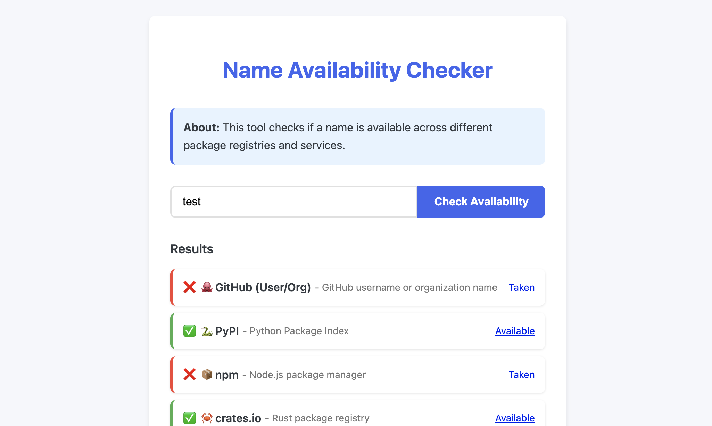

# Name Availability Checker

A web application that checks if a name is available across different package registries and services. Perfect for developers looking to name their new libraries, packages, or projects.



## 🌟 Features

- **Multi-Service Checking**: Check name availability across 15+ package registries and services
- **Concurrent Checks**: All services are checked simultaneously for fast results
- **Clickable Results**: All status types (Available, Taken, CORS Restriction) are clickable links
- **Search History**: Recent searches are saved and easily accessible
- **Dark Mode**: Toggle between light and dark themes
- **Responsive Design**: Works on desktop and mobile devices
- **Serverless Architecture**: Uses Vercel serverless functions to handle CORS-restricted services
- **Caching**: API responses are cached for 10 minutes to improve performance

## 🚀 Live Demo

Check out the live application: [Name Availability Checker](https://software-name-checker.vercel.app
)

## 📋 Supported Services

- GitHub (User/Org)
- PyPI (Python Package Index)
- npm (Node.js)
- crates.io (Rust)
- Homebrew (macOS)
- Ubuntu Packages
- RubyGems
- Maven Central (Java)
- NuGet (.NET)
- CPAN (Perl)
- Packagist (PHP)
- Go Modules
- Julia Registry
- Dart/Flutter Pub

## 🛠️ Technologies Used

- **Frontend**: HTML, CSS, JavaScript
- **Backend**: Vercel Serverless Functions
- **Caching**: Vercel Data Cache
- **Deployment**: Vercel

## 🔧 Local Development

### Prerequisites

- Node.js (v14 or later)
- Vercel CLI

### Setup

1. Clone the repository:
   ```bash
   git clone https://github.com/billiegoose/name-checker.git
   cd name-checker
   ```

2. Install Vercel CLI:
   ```bash
   npm install -g vercel
   ```

3. Run the development server:
   ```bash
   vercel dev
   ```

4. Open your browser to http://localhost:3000

## 📦 Project Structure

- `public/index.html` - Main application HTML, CSS, and JavaScript
- `api/check-all.js` - Serverless function for CORS-restricted checks
- `vercel.json` - Vercel configuration file

## 🚀 Deployment

The application is deployed on Vercel. To deploy your own instance:

1. Fork this repository
2. Install Vercel CLI: `npm install -g vercel`
3. Login to Vercel: `vercel login`
4. Deploy: `vercel --prod`

## 📝 How It Works

- **Direct API Calls**: Services with CORS-friendly APIs are checked directly from the browser
- **Serverless Proxies**: Services with CORS restrictions are checked via Vercel serverless functions
- **Caching**: API responses are cached for 10 minutes using Vercel's Data Cache
- **CORS Handling**: For some services (RubyGems, Julia), CORS errors are treated as indicating availability

## 📄 License

This project is licensed under the MIT License - see the [LICENSE](LICENSE) file for details.

## 🙏 Acknowledgements

- [Vercel](https://vercel.com) for hosting and serverless functions
- All the package registries and services for their APIs
- [Billie Hilton](https://github.com/billiegoose) for creating this tool
